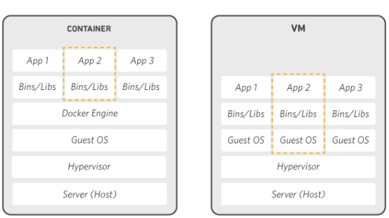
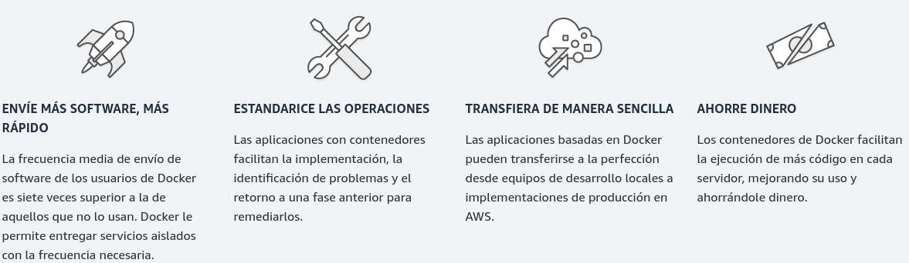
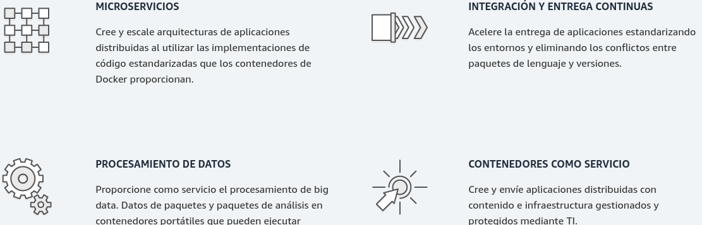
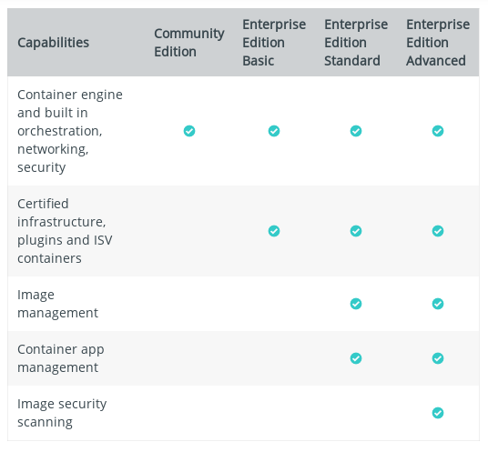
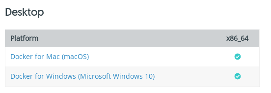
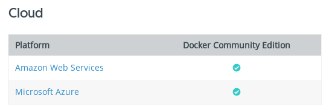
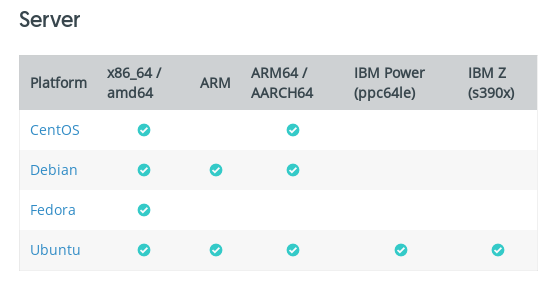

¿Qué es Docker?
================

Docker es un sistema de “virtualización” que usa algunas tecnologías, entre ellas el LXC del kernel de Linux.
La principal ventaja de este sistema frente a los habituales métodos de virtualización es la rapidez con la que se arranca y se para una máquina. Esto es debido a que desaparece el sistema operativo del invitado con lo que pasamos de 2 o 3 minutos que puede tardar un arranque con VMWARE , VirtualBOX o cualquier virtualizador,  a un par de segundos.
El uso de esta tecnología nos debe hacer cambiar el concepto de como organizar nuestras aplicaciones. Tenemos que descomponer todos los elementos y tratarlos como cajas negras que nos devuelven algo que necesitamos (Funciones o Metodos).
Otro de los concepto que hay que manejar cuando se trabaja con Docker es el hecho de nuestras aplicación tiene que funcionar tras eliminar un contenedor y volverlo a crear. Eso significa que tenemos que saber que datos tienen que ser persistentes y de que máquina así como todos los procesos que se harán cuando el contenedor arranque.
Más información ver pagina oficial: https://docs.docker.com/get-started/

Docker es una plataforma de software que le permite crear, probar e implementar aplicaciones rápidamente.
Docker es una plataforma de software que le permite crear, probar e implementar aplicaciones rápidamente. Docker empaqueta software en unidades estandarizadas llamadas contenedores que incluyen todo lo necesario para que el software se ejecute. Con Docker, puede implementar y ajustar la escala de aplicaciones rápidamente en cualquier entorno con la certeza de saber que su código se ejecutará.

Cómo funciona Docker
++++++++++++++++++++

Docker le proporciona una manera estándar de ejecutar su código. Docker es un sistema operativo para contenedores. De manera similar a cómo una máquina virtual virtualiza (elimina la necesidad de administrar directamente) el hardware del servidor, los contenedores virtualizan el sistema operativo de un servidor. Docker se instala en cada servidor y proporciona comandos sencillos que puede utilizar para crear, iniciar o detener contenedores.

Por qué usar Docker
+++++++++++++++++++++

Docker le permite entregar código con mayor rapidez, estandarizar las operaciones de las aplicaciones, transferir el código con facilidad y ahorrar dinero al mejorar el uso de recursos. Con Docker, obtiene un solo objeto que se puede ejecutar de manera fiable en cualquier lugar. La sintaxis sencilla y simple de Docker le aporta un control absoluto. La amplia adopción significa que existe un gran ecosistema de herramientas y aplicaciones listas para su uso que puede utilizar con Docker.

Cuándo usar Docker
======================

Puede utilizar los contenedores de Docker como bloque de construcción principal a la hora de crear aplicaciones y plataformas modernas. Docker facilita la creación y la ejecución de arquitecturas de microservicios distribuidos, la implementación de código con canalizaciones de integración y entrega continuas estandarizadas, la creación de sistemas de procesamiento de datos altamente escalables y la creación de plataformas completamente administradas para sus desarrolladores.

Ediciones de Docker
+++++++++++++++++++++

Docker esta disponible en dos ediciones
Community Edition (CE)
Enterprise Edition (EE)

Acerca de Docker CE
+++++++++++++++++++

Docker Community Edition (CE) es ideal para desarrolladores y pequeños equipos que buscan comenzar con Docker y experimentar con aplicaciones basadas en contenedores. Docker CE tiene dos canales de actualización, estable y de borde:
Estable le brinda actualizaciones confiables cada trimestre.
Edge te ofrece nuevas funciones cada mes.
Para obtener más información acerca de Docker CE, consulte Docker Community Edition. https://www.docker.com/community-edition/

Acerca de Docker EE
++++++++++++++++++++

Docker Enterprise Edition (EE) está diseñado para el desarrollo empresarial y los equipos de TI que crean, envían y ejecutan aplicaciones críticas para el negocio en producción a escala.
https://docs.docker.com/install/overview/

IMPORTANTE: Docker EE se requiere tener un contrato de Soporte.

Tabla comparativa 
+++++++++++++++++

Plataformas Soportadas para Docker CE
++++++++++++++++++++++++++++++++++++++++

Docker CE está disponible en múltiples plataformas, en la nube y en las instalaciones. Use las siguientes tablas para elegir la mejor ruta de instalación para usted.

 

Plataformas Soportadas para Docker EE
++++++++++++++++++++++++++++++++++++++

Docker EE está disponible en múltiples plataformas, en la nube y en las instalaciones. Use las siguientes tablas para elegir la mejor ruta de instalación para usted.

.. figure:: ../images/04.png

 
 

Links oficiales de como instalar Docker CE y Docker EE
+++++++++++++++++++++++++++++++++++++++++++++++++++++++

Para Docker-CE:

https://docs.docker.com/install/linux/docker-ce/centos/
https://docs.docker.com/install/linux/docker-ce/debian/
https://docs.docker.com/install/linux/docker-ce/fedora/
https://docs.docker.com/install/linux/docker-ce/ubuntu/

Para Docker-EE:

https://docs.docker.com/install/linux/docker-ee/centos/
https://docs.docker.com/install/linux/docker-ee/oracle/
https://docs.docker.com/install/linux/docker-ee/rhel/
https://docs.docker.com/install/linux/docker-ee/ubuntu/

Instalar Docker CE en CentOS x86_64 / amd64
++++++++++++++++++++++++++++++++++++++++++++

Nosotros vamos a instalar Docker CE por ser 100% libre y no el Docker EE.  La documentación oficial la puede encontrar en https://docs.docker.com/install/linux/docker-ce/centos/

Para comenzar con Docker CE en CentOS, asegúrese de cumplir con los requisitos previos, luego instale Docker.

SO Requisitos
++++++++++++++

Para instalar Docker CE, necesita una versión mantenida de CentOS 7. Las versiones archivadas no son compatibles ni están probadas.
El repositorio centos-extras debe estar habilitado. Este repositorio está habilitado de forma predeterminada, pero si lo ha deshabilitado, debe volver a habilitarlo.
Se recomienda el controlador de almacenamiento overlay2.

Tener configurado de forma correcta el archivo hostname y hosts
+++++++++++++++++++++++++++++++++++++++++++++++++++++++++++++++

::

	# vi /etc/hostname
	srvdocker01.localdomain

::

	vi /etc/hosts
	127.0.0.1   localhost localhost.localdomain localhost4 localhost4.localdomain4
	::1         localhost localhost.localdomain localhost6 localhost6.localdomain6
	192.168.0.213   srvdocker01.localdomain

Instalar el repositorio EPEL
+++++++++++++++++++++++++++++

::

	# yum search epel
	# yum install -y epel-release.noarch

Deshabilitar Selinux
++++++++++++++++++++++

Esto solo por ser en un ambiente de desarrollo, no hacer esto en producción.::

	# vi /etc/selinux/config
	SELINUX=disabled

Deshabilitar el Firewall
++++++++++++++++++++++++++

Esto solo por ser en un ambiente de desarrollo, no hacer esto en producción.::

	# systemctl disable firewalld
	# systemctl stop firewalld
	# systemctl status firewalld

Preferiblemente un FileSystem aparte para la instalación de Docker.
+++++++++++++++++++++++++++++++++++++++++++++++++++++++++++++++++++

Esto es opcional.::

	# mount | grep docker
	/dev/sdb1 on /var/lib/docker type ext4 (rw,relatime,data=ordered)

	# df -h /var/lib/docker/
	S.ficheros     Tamaño Usados  Disp Uso% Montado en
	/dev/sdb1         30G    45M   28G   1% /var/lib/docker

Administrar Docker con un usuario no root
+++++++++++++++++++++++++++++++++++++++++

El daemon docker se une a un socket Unix en lugar de a un puerto TCP. Por defecto, el socket de Unix es propiedad de la raíz del usuario y otros usuarios solo pueden acceder a él usando sudo. El daemon docker siempre se ejecuta como el usuario raíz.
Si no desea usar sudo cuando usa el comando docker, cree un grupo Unix llamado docker y agregue usuarios a él. Cuando se inicia el daemon docker, el grupo docker hace que la propiedad del socket Unix sea read/writable.

Para crear el grupo de acopladores y agregar a su usuario:

1. Crear un usuario y asignarle una clave::

	# adduser oracle
	# passwd oracle

2. Crea el grupo de Docker.::

	# groupadd docker

3.  Agregue su usuario al grupo de Docker y verificamos. Esto es muy IMPORTANTE.::

	# usermod -aG docker oracle

4. Ejecutar el newgrp::

	# newgrp docker 
4. Verificar que pueda correr docker sin usar el comando sudo.::
	
	$ docker run hello-world

5. Al usuario le damos privilegios de sudo.::

	# visudo
	## Allow root to run any commands anywhere
	root    ALL=(ALL)       ALL
	oracle  ALL=(ALL)       ALL

6. Cierre sesión y vuelva a iniciar sesión para que se vuelva a evaluar su membresía grupal. Si prueba en una máquina virtual, puede ser necesario reiniciar la máquina virtual para que los cambios surtan efecto. En un entorno Linux de escritorio, como X Windows, cierre la sesión por completo y luego vuelva a iniciar sesión.::

	# id oracle
	uid=1000(oracle) gid=1000(oracle) grupos=1000(oracle),1001(docker)

Para desinstalar versiones obsoletas de Docker
++++++++++++++++++++++++++++++++++++++++++++++

Las versiones anteriores de Docker se llamaban docker o docker-engine. Si están instalados, desinstálelos, junto con las dependencias asociadas.::

	$ sudo yum remove docker \
		          docker-client \
		          docker-client-latest \
		          docker-common \
		          docker-latest \
		          docker-latest-logrotate \
		          docker-logrotate \
		          docker-selinux \
		          docker-engine-selinux \
		          docker-engine

Está bien si yum informa que ninguno de estos paquetes está instalado.
El contenido de /var/lib/docker/, incluyendo imágenes, contenedores, volúmenes y redes, se conservan. El paquete Docker CE ahora se llama docker-ce.

Obtener Docker CE para CentOS 7
++++++++++++++++++++++++++++++++

Puede instalar Docker CE de diferentes formas, según sus necesidades:
1. La mayoría de los usuarios configuran repositorios de Docker e instalan desde ellos, para facilitar la instalación y las tareas de actualización. Este es el enfoque recomendado.
2. Algunos usuarios descargan el paquete RPM, lo instalan de forma manual y administran las actualizaciones de forma completamente manual. Esto es útil en situaciones como la instalación de Docker en sistemas de espacio aéreo sin acceso a Internet.
3. En entornos de prueba y desarrollo, algunos usuarios optan por utilizar scripts automatizados de conveniencia para instalar Docker.
**NOTA: Esta técnica funciona también para instalar el Docker CE en Centos 7, Red Hat 7 y Oracle Linux 7.**

Instalando Docker CE utilizando el Repositorio
++++++++++++++++++++++++++++++++++++++++++++++++

Antes de instalar Docker CE por primera vez en una máquina host nueva, debe configurar el repositorio Docker. Después, puede instalar y actualizar Docker desde el repositorio.

Para configurar el repositorio:

1. Instalar los paquetes requeridos. yum-utils proporciona la utilidad yum-config-manager, y device-mapper-persistent-data y lvm2 son requeridos por el controlador de almacenamiento de devicemapper.::

	$ sudo yum install -y yum-utils \
	  device-mapper-persistent-data \
	  lvm2

2. Use el siguiente comando para configurar el repositorio estable. Siempre necesita el repositorio estable, incluso si desea instalar compilaciones desde el Edge o repositorios de prueba y verificamos::

	$ sudo yum-config-manager \
	    --add-repo \
	    https://download.docker.com/linux/centos/docker-ce.repo

	$ yum repolist enabled

Solo si es Red Hat hacemos estos pasos adicionales. Pero NO es recomendado.::

	$ sudo yum makecache fast
	$ sudo yum install -y http://mirror.centos.org/centos/7/extras/x86_64/Packages/container-selinux-2.42-1.gitad8f0f7.el7.noarch.rpm

3.  Opcional: habilite los repositorios de Edge y prueba. Estos repositorios están incluidos en el archivo docker.repo anterior pero están deshabilitados de forma predeterminada. Puede habilitarlos junto con el repositorio estable.::

	$ sudo yum-config-manager --enable docker-ce-edge

	$ sudo yum-config-manager --enable docker-ce-test

Puede deshabilitar el repositorio edge o test ejecutando el comando yum-config-manager con el indicador --disable. Para volver a habilitarlo, use la bandera --enable. El siguiente comando desactiva el repositorio de borde.::

	$ sudo yum-config-manager --disable docker-ce-edge

Instalar Docker CE
+++++++++++++++++++

1. Instale la última versión de Docker CE, o vaya al siguiente paso para instalar una versión específica::

	$ sudo yum install docker-ce

Si se le solicita que aceptar la clave GPG, verifique que la huella digital coincida con esta::

	060A 61C5 1B55 8A7F 742B 77AA C52F EB6B 621E 9F35

y si es así, acéptarlo.
Docker está instalado pero no iniciado. 

2. Para instalar una versión específica de Docker CE, enumere las versiones disponibles en el repositorio, luego seleccione e instale:
a. Haga una lista y clasifique las versiones disponibles en su repositorio. Este ejemplo ordena los resultados por número de versión, de mayor a menor, y se trunca::

	$ yum list docker-ce --showduplicates | sort -r
	docker-ce.x86_64            18.03.0.ce-1.el7.centos             docker-ce-stable

La lista devuelta depende de qué repositorios están habilitados y es específico de su versión de CentOS (indicado por el sufijo .el7 en este ejemplo).

b. segundo. Instale una versión específica por su nombre completo de paquete, que es el nombre del paquete (docker-ce) más la cadena de versión (segunda columna) hasta el primer guión, separados por un guión (-), por ejemplo, docker-ce- 18.03.0.ce.::
	
	$ sudo yum install docker-ce-<VERSION STRING>

Docker está instalado pero no iniciado.

3. Iniciar Docker::

	$ sudo systemctl start docker

4.  Verifique que Docker esté instalada correctamente ejecutando la imagen de hello-world.::

	$ sudo docker run hello-world

Este comando descarga una imagen de prueba y la ejecuta en un contenedor. Cuando el contenedor se ejecuta, imprime un mensaje informativo y sale.
Docker CE está instalado y ejecutándose. Necesita usar sudo para ejecutar los comandos de Docker. Continúe con Linux postinstall para permitir que los usuarios sin privilegios ejecuten los comandos de Docker y otros pasos de configuración opcionales.

Actualizar Docker CE con yum
++++++++++++++++++++++++++++++

Usando yum -y upgrade en lugar de yum -y install, y señalando el nuevo archivo.

Instalar desde un paquete
++++++++++++++++++++++++++

Si no puede usar el repositorio de Docker para instalar Docker, puede descargar el archivo .rpm para su versión e instalarlo manualmente. Debe descargar un archivo nuevo cada vez que desee actualizar Docker.
1. Vaya a https://download.docker.com/linux/centos/7/x86_64/stable/Packages/ y descargue el archivo .rpm para la versión de Docker que desea instalar.

Nota: Para instalar un paquete de Edge, cambie la palabra estable en la URL anterior a edge.
2.  instale Docker CE, cambiando la ruta a continuación a la ruta donde descargó el paquete Docker.::

	$ sudo yum install /path/to/package.rpm

Docker está instalado pero no iniciado. Se crea el grupo de acopladores, pero no se agregan usuarios al grupo.

3. Iniciar Docker.::

	$ sudo systemctl start docker

4. Verificamos la estructura y su tamaño de directorios.::

	$ sudo du -sh /var/lib/docker/
	256K	/var/lib/docker/

	# ls -ltr /var/lib/docker/
	total 64
	drwx------ 2 root root 16384 may 11 16:26 lost+found
	drwx--x--x 3 root root  4096 may 11 16:30 containerd
	drwx------ 2 root root  4096 may 11 16:30 tmp
	drwx------ 2 root root  4096 may 11 16:30 containers
	drwx------ 2 root root  4096 may 11 16:30 runtimes
	drwx------ 4 root root  4096 may 11 16:30 plugins
	drwx------ 2 root root  4096 may 11 16:30 volumes
	drwx------ 3 root root  4096 may 11 16:30 image
	drwx------ 2 root root  4096 may 11 16:30 trust
	drwxr-x--- 3 root root  4096 may 11 16:30 network
	drwx------ 3 root root  4096 may 11 16:30 overlay2
	drwx------ 2 root root  4096 may 11 16:30 swarm
	drwx------ 2 root root  4096 may 11 16:30 builder

5.  Verifique que Docker esté instalada correctamente ejecutando la imagen de hello-world.::

	$ sudo docker run hello-world

Este comando descarga una imagen de prueba y la ejecuta en un contenedor. Cuando el contenedor se ejecuta, imprime un mensaje informativo y sale.
Docker CE está instalado y ejecutándose. Necesita usar sudo para ejecutar los comandos de Docker. Continúe con los pasos posteriores a la instalación de Linux para permitir que los usuarios sin privilegios ejecuten los comandos de Docker y otros pasos de configuración opcionales.

Actualizar Docker CE desde un RPM
++++++++++++++++++++++++++++++++++

Para actualizar Docker CE, descargue el archivo del paquete más nuevo y repita el procedimiento de instalación.

Configurar Docker para iniciar al arrancar
+++++++++++++++++++++++++++++++++++++++++++++

La mayoría de las distribuciones de Linux (RHEL, CentOS, Fedora, Ubuntu 16.04 y posteriores) utilizan systemd para administrar qué servicios se inician cuando se inicia el sistema. Ubuntu 14.10 y siguientes usan upstart o Systemd::

	$ sudo systemctl enable docker

Para deshabilitar este comportamiento, use desactivar en su lugar.::

	$ sudo systemctl disable docker

Si necesita agregar un Proxy HTTP, configurar un directorio o partición diferente para los archivos de tiempo de ejecución de Docker, o realizar otras personalizaciones, consulte personalizar las opciones de daemon de Docker de su sistema. https://docs.docker.com/config/daemon/systemd/

Con Upstart. Docker se configura automáticamente para iniciar al arrancar usando upstart. Para deshabilitar este comportamiento, use el siguiente comando::

	$ echo manual | sudo tee /etc/init/docker.override

Chkconfig::
	
	$ sudo chkconfig docker on

Verificar que Docker este operativo
++++++++++++++++++++++++++++++++++++

Verifique que puede ejecutar los comandos de docker sin sudo.::

	$ docker run hello-world

Este comando descarga una imagen de prueba y la ejecuta en un contenedor. Cuando el contenedor se ejecuta, imprime un mensaje informativo y sale.
Si inicialmente ejecutó los comandos de Docker CLI con sudo antes de agregar a su usuario al grupo de Docker, puede ver el siguiente error, que indica que su directorio ~ / .docker / se creó con permisos incorrectos debido a los comandos sudo.
WARNING: Error loading config file: /home/user/.docker/config.json -
stat /home/user/.docker/config.json: permission denied

Para solucionar este problema, elimine el directorio ~ / .docker / (se recrea automáticamente, pero se pierde cualquier configuración personalizada) o cambie su propiedad y permisos utilizando los siguientes comandos::

	$ sudo chown "$USER":"$USER" /home/"$USER"/.docker -R
	$ sudo chmod g+rwx "/home/$USER/.docker" -R

Cambiar la ruta raiz de Docker CE
+++++++++++++++++++++++++++++++++++++

Cuando iniciamos docker toda la estructura es creada por defecto en  “/var/lib/docker”, pero la podemos cambiar, debemos crear el siguiente archivo daemon.json en el directorio /etc/docker::

	$ vi /etc/docker/daemon.json
	{ 
	   "data-root": "/home/srv/docker" 
	}

Tambien debemos modificar el docker.service.::

	$ vi /lib/systemd/system/docker.service
		# Buscar esta linea
		ExecStart=/usr/bin/dockerd 
		# Cambiar a:
		ExecStart=/usr/bin/dockerd -g /home/srv/docker

Recuerda luego copiar mover el contenido de “/var/lib/docker” hacia la nueva ruta y ahora si podras iniciar el Docker en su nueva ruta.::

	# mv /var/lib/docker /home/srv/docker

Dememos recargar el systemctl::

	systemctl daemon-reload
	systemctl start docker

Ahora ejecutamos docker info tendremos la evidencia contundente::

	docker info | grep Root

Información del Docker instalado
++++++++++++++++++++++++++++++++

Consultar la info de docker::

	$ docker info

Primeros pasos con Docker
+++++++++++++++++++++++++

Lo primero que debe aprender son estos dos terminos “Imagen” “Contenedor”
La imagen Docker podríamos entenderla como un SO con aplicaciones instaladas (Por ejemplo un OpenSUSE con un paquete ofimático). Sobre esta base podremos empezar a añadir aplicaciones que vayamos a necesitar en otro equipo donde tengamos intención de usar la imagen. Además Docker nos ofrece una forma muy sencilla de actualizar las imágenes que tengamos creadas, así como un sencillo método para crear nuevas imágenes.
El Contenedores Docker son como un directorio, contienen todo lo necesario para que una aplicación pueda funcionar sin necesidad de acceder a un repositorio externo al contenedor. Cada uno de éstos es una plataforma de aplicaciones segura y aislada del resto que podamos encontrar o desplegar en la misma máquina host. El contenedor de Docker es instanciado en Memoria.
En un principio contamos con una imagen base , sobre la que realizaremos los diferentes cambios. Tras confirmar estos cambios mediante la aplicación Docker , crearemos la imagen que usaremos. Esta imagen contiene únicamente las diferencias que hemos añadido con respecto a la base. Cada vez que queramos ejecutar esta imagen necesitaremos la base y las 'capas' de la imagen. Docker se encargará de acoplar la base, la imagen y las diferentes capas con los cambios para darnos el entorno que queremos desplegar para empezar a trabajar.

Como crear las Imagenes
++++++++++++++++++++++++++++++++++++++

Las imágenes las podemos crear desde :

Repositorios oficiales.

Desde un archivo llamado Dockerfile.

Desde un Container.

Utilizaremos la opción de “crear imágenes desde Dockerfile” porque nos permite hacer paso a paso todas las  configuraciones, lo cual nos permite tener el control total de una imagen Docker.

Que es una imagen
++++++++++++++++++

Las imágenes de Docker son la base de los contenedores. Una imagen es una colección ordenada de cambios en el sistema de archivos raíz y los parámetros de ejecución correspondientes para su uso dentro en el tiempo de ejecución de un contenedor. Una imagen generalmente contiene una unión de sistemas de archivos en capas apilados uno encima del otro. Una imagen no tiene estado y nunca cambia.

Que es un contenedor
++++++++++++++++++++

Un contenedor es una instancia en tiempo de ejecución de una imagen de Docker.
Un contenedor Docker laboratoriote en:

Una imagen Docker

Un entorno de ejecución

Un conjunto estándar de instrucciones

El concepto se toma prestado de Contenedores de envío, que definen un estándar para enviar productos a nivel mundial. Docker define un estándar para enviar software.

***Una instancia de una imagen se llama contenedor. Tienes una imagen, que es un conjunto de capas como describes. Si inicializa una imagen, tiene un contenedor en ejecución de esta imagen. Puede tener muchos contenedores en ejecución de la misma imagen.***

Que es Dockerfile
+++++++++++++++++++

Docker puede construir imágenes automáticamente leyendo las instrucciones de un Dockerfile. Un Dockerfile es un documento de texto que contiene todos los comandos que un usuario podría llamar en la línea de comando para ensamblar una imagen. Al usar Docker los usuarios de compilación pueden crear una compilación automatizada que ejecuta varias instrucciones de línea de comandos en sucesión.

Dockerfile: Creación de imágenes docker
++++++++++++++++++++++++++++++++++++++++

Usando el comando docker buid y definiendo las características que queremos que tenga la imagen en un fichero Dockerfile crearemos una imagen nueva.

Un Dockerfile es un fichero de texto donde indicamos los comandos que queremos ejecutar sobre una imagen base para crear una nueva imagen. El comando docker build construye la nueva imagen leyendo las instrucciones del fichero Dockerfile y la información de un entorno, que para nosotros va a ser un directorio (aunque también podemos guardar información, por ejemplo, en un repositorio git).
La creación de la imagen es ejecutada por el docker engine, que recibe toda la información del entorno, por lo tanto es recomendable guardar el Dockerfile en un directorio vacío y añadir los ficheros necesarios para la creación de la imagen. El comando docker build ejecuta las instrucciones de un Dockerfile línea por línea y va mostrando los resultados en pantalla.
Tenemos que tener en cuenta que cada instrucción ejecutada crea una imagen intermedia, una vez finalizada la construcción de la imagen nos devuelve su id. Alguna imágenes intermedias se guardan en caché, otras se borran. Por lo tanto, si por ejemplo, en un comando ejecutamos cd /scripts/ y en otra linea le mandamos a ejecutar un script (./install.sh) no va a funcionar, ya que ha lanzado otra imagen intermedia. Teniendo esto en cuenta, la manera correcta de hacerlo sería::

	cd /scripts/;./install.sh

Para terminar indicar que la creación de imágenes intermedias generadas por la ejecución de cada instrucción del Dockerfile, es un mecanismo de caché, es decir, si en algún momento falla la creación de la imagen, al corregir el Dockerfile y volver a construir la imagen, los pasos que habían funcionado anteriormente no se repiten ya que tenemos a nuestra disposición las imágenes intermedias, y el proceso continúa por la instrucción que causó el fallo.
**Los contenedores deber ser “efímeros”**
Cuando decimos “efímeros” queremos decir que la creación, parada, despliegue de los contenedores creados a partir de la imagen que vamos a generar con nuestro Dockerfile debe tener una mínima configuración.

**Uso de ficheros .dockerignore**
Todos los ficheros del contexto se envían al docker engine, es recomendable usar un directorio vacío donde vamos creando los ficheros que vamos a enviar. Además, para aumentar el rendimiento, y no enviar al daemon ficheros innecesarios podemos hacer uso de un fichero .dockerignore, para excluir ficheros y directorios.
**No instalar paquetes innecesarios**
Para reducir la complejidad, dependencias, tiempo de creación y tamaño de la imagen resultante, se debe evitar instalar paquetes extras o innecesarios Si algún paquete es necesario durante la creación de la imagen, lo mejor es desinstalarlo durante el proceso.
**Minimizar el número de capas**
Debemos encontrar el balance entre la legibilidad del Dockerfile y minimizar el número de capa que utiliza.
**Indicar las instrucciones a ejecutar en múltiples líneas**
Cada vez que sea posible y para hacer más fácil futuros cambios, hay que organizar los argumentos de las instrucciones que contengan múltiples líneas, esto evitará la duplicación de paquetes y hará que el archivo sea más fácil de leer. Por ejemplo::
	
	RUN apt-get update && apt-get install -y \
	git \
	wget \
	apache2 \
	php5

Instrucciones de Dockerfile
++++++++++++++++++++++++++++

Introducción al uso de las instrucciones más usadas que podemos definir dentro de un fichero Dockerfile, para una descripción más detallada consulta la documentación oficial. https://docs.docker.com/engine/reference/builder/#format

**FROM:** indica la imagen base que va a utilizar para seguir futuras instrucciones. Buscará si la imagen se encuentra localmente, en caso de que no, la descargará de internet.::

	FROM centos:7

**MAINTAINER:** Nos permite configurar datos del autor, principalmente su nombre y su dirección de correo electrónico.::

	MAINTAINER Carlos Gomez G cgomeznt@gmail.com

**ENV:** Configura las variables de entorno.::

	ENV	export MW_HOME=/u01/app/oracle/middleware

**ADD:** Esta instrucción se encarga de copiar los ficheros y directorios desde una ubicación especificada y los agrega al sistema de ficheros del contenedor. Si se trata de añadir un fichero comprimido, al ejecutarse el guión lo descomprimirá de manera automática.::

	ADD Generate-Schematool.tar /u01/software

**COPY:** Es la expresión recomendada para copiar ficheros, similar a ADD.::

	COPY	jdk-7u79-linux-x64.rpm	/u01/software

**RUN:** Esta instrucción ejecuta cualquier comando en una capa nueva encima de una imagen y hace un commit de los resultados. Esa nueva imagen intermedia es usada para el siguiente paso en el Dockerfile. RUN tiene 2 formatos::

	El modo shell: /bin/sh -c
		RUN comando
::

	Modo ejecución:
		RUN ["ejecutable", "parámetro1", "parámetro2"]

El modo ejecución nos permite correr comandos en imágenes bases que no cuenten con /bin/sh , nos permite además hacer uso de otra shell si así lo deseamos, ejemplo::

	RUN ["/bin/bash", "-c", "echo prueba"]

**EXPOSE:** Indica los puertos en los que va a escuchar el contenedor. Hay que tener en cuenta que esta opción no consigue que los puertos sean accesibles desde el host; para esto debemos utilizar la exposición de puertos mediante la opción -p de docker run.::

	EXPOSE 80 443

**VOLUME:** Nos permite utilizar en el contenedor una ubicación de nuestro host, y así, poder almacenar datos de manera permanente. Los volúmenes de los contenedores siempre son accesibles en el host anfitrión, en la ubicación: /var/lib/docker/volumes/::

	VOLUME "/opt/tomcat/webapps"

**WORKDIR:** El directorio por defecto donde ejecutaremos las acciones.::

	WORKDIR /opt/tomcat

**USER:** Por defecto, todas las acciones son realizadas por el usuario root. Aquí podemos indicar un usuario diferente.::

	USER	oracle

**SHELL:** En los contenedores, el punto de entrada es el comando /bins/sh -c para ejecutar los comandos específicos en CMD, o los comandos especificados en línea de comandos para la acción run.

**ARG:** Podemos añadir parámetros a nuestro Dockerfile para distintos propósitos.::

	ARG PORT=7021

**CMD y ENTRYPOINT:** Estas dos instrucciones son muy parecidas, aunque se utilizan en situaciones diferentes, y además pueden ser usadas conjuntamente, en el siguiente artículo se explica muy bien su uso.
Estas dos instrucciones nos permiten especificar el comando que se va a ejecutar por defecto, sino indicamos ninguno cuando ejecutamos el docker run. Normalmente las imágenes bases (debian, ubuntu,…) están configuradas con estas instrucciones para ejecutar el comando /bin/sh o /bin/bash. Podemos comprobar el comando por defecto que se ha definido en una imagen con el siguiente comando::

	$ docker inspect debian
	...
	 "Cmd": [
		        "/bin/bash"
		    ],
	...

Por lo tanto no es necesario indicar el comando como argumento, cuando se inicia un contenedor::

	$ docker run -i -t  debian

CMD tiene tres formatos::
	Formato de ejecución:
		CMD ["ejecutable", "parámetro1", "parámetro2"]
	Modo shell:
		CMD comando parámetro1 parámetro2
	Formato para usar junto a la instrucción ENTRYPOINT
		CMD ["parámetro1","parámetro2"]

Solo puede existir una instrucción CMD en un Dockerfile, si colocamos más de una, solo la última tendrá efecto.Se debe usar para indicar el comando por defecto que se va a ejecutar al crear el contenedor, pero permitimos que el usuario ejecute otro comando al iniciar el contenedor.
ENTRYPOINT tiene dos formatos::

	Formato de ejecución:
		ENTRYPOINT ["ejecutable", "parámetro1", "parámetro2"]
	Modo shell:
		ENTRYPOINT comando parámetro1 parámetro2

Esta instrucción también nos permite indicar el comando que se va ejecutar al iniciar el contenedor, pero en este caso el usuario no puede indicar otro comando al iniciar el contenedor. Si usamos esta instrucción no permitimos o no  esperamos que el usuario ejecute otro comando que el especificado. Se puede usar junto a una instrucción CMD, donde se indicará los parámetro por defecto que tendrá el comando indicado en el ENTRYPOINT. Cualquier argumento que pasemos en la línea de comandos mediante docker run serán anexados después de todos los elementos especificados mediante la instrucción ENTRYPOINT, y anulará cualquier elemento especificado con CMD.
Ejemplo
Si tenemos un fichero Dockerfile, que tiene las siguientes instrucciones::

	ENTRYPOINT [“http”, “-v ]”
	CMD [“-p”, “80”]

Podemos crear un contenedor a partir de la imagen generada:
docker run centos:centos7: Se creará el contenedor con el servidor web escuchando en el puerto 80.
docker run centos:centros7 -p 8080: Se creará el contenedor con el servidor web escuchando en el puerto 8080.

Hacer una imagen de Docker CE con Dockerfile
++++++++++++++++++++++++++++++++++++++++++++

Vamos a crear una imagen con la ayuda del archivo Dockerfile, dentro de él vamos a colocar todas las lineas de instrucciones necesarias para que se descargue una imagen base, luego dentro de ella vamos a copiar algun archivo y/o instaladores que necesitemos para hacer este laboratorio y por ultimo con el comando build procedemos a crear la imagen.

Crear un directorio de trabajo
++++++++++++++++++++++++++++++
::

	$ mkdir laboratorio
	$ cd laboratorio/
	[oracle@nodo1 laboratorio]$

Crear el archivo Dockerfile
+++++++++++++++++++++++++++

Vamos a crear un Dockerfile que haga lo siguiente.:

Crear una base de la imagen.

Actualizar la base de la imagen.

Crear el usuario y grupo.

Crear los directorios para demostración.

Crear las variables para demostración.

Crear variable de entorno para demostración.

Copiar los archivos base y de configuración dentro de la imagen.

Asignar los permisos a los directorios creados.

Instalar el Apache.

Instalar la versión de JAVA.

Cambiarse con el usuario creado realizar la instalación.

Iniciar el servicio de Apache con systemctl. Utilizar systemctl tiene unos tips

Crear un volumen que permite modificar, eliminar o agregar archivos y/o directorios luego que el CONTENEDOR este en uso.

Exponer el puerto por donde una aplicación escuchara las peticiones. para demostración.

Así quedaría el archivo Dockerfile y lo copiamos en en directorio laboratorio::

	$ vi Dockerfile
	FROM centos:7

	MAINTAINER Carlos Gomez G cgomeznt@gmail.com

	# Declaramos las siguientes variables por recomendaciones d Docker
	ENV     container docker

	# Instalamos paquetes necesarios para la base que nos permitan administrar y hacer troubleshooting
	RUN     yum -y install sudo \
		httpd.x86_64 \
		net-tools \
		unzip

	# Limpiamos los temporales de yum
	RUN     yum clean all

	# Creamos el usuario y grupo valido para inicializar el Weblogic
	RUN     groupadd oinstall
	RUN     useradd -g oinstall oracle

	# Creamos los directorios requeridos para copiar los archivos base, configuraciones y otras segun sea la necesidad. Tambien le otorgamos los permisos.
	RUN     mkdir -p /u01/software && \
		mkdir -p /scm/EAR && \
		mkdir -p /scm/external && \
		mkdir -p /scm/scripts && \
		mkdir -p /scm/logs && \
		mkdir -p /u01/app/oracle/middleware && \
		mkdir -p /u01/app/oracle/config/domains && \
		mkdir -p /u01/app/oracle/config/applications

	# Creamos las variables para demostración
	ENV     export MW_HOME=/u01/app/oracle/middleware
	ENV     export WLS_HOME=$MW_HOME/wlserver
	ENV     export WL_HOME=$WLS_HOME

	# Creamos la variable del JAVA_HOME y lo colocamos en el PATH
	ENV     export JAVA_HOME=/u01/app/oracle/jdk1.8.0_77
	ENV     export PATH=$JAVA_HOME/bin:$PATH

	# Copiamos la version del JAVA y lo instalamos
	COPY    jdk-8u101-linux-x64.rpm /u01/software
	RUN     rpm -ivh /u01/software/jdk-8u101-linux-x64.rpm

	# Copiamos los archivos base y de configuracion dentro de la imagen.
	COPY    startMyAPP.sh /scm/scripts
	COPY    stopMyAPP.sh /scm/scripts
	RUN     chown -R oracle:oinstall /u01 && \
		chown -R oracle:oinstall /scm && \
		chmod -R 775 /u01/ && \
		chmod -R 775 /scm/

	# Limpiamos todos los archivo que ya no son requeridos para la imagen.
	RUN     rm -rf /u01/software/*

	# Creamos este volumen que nos permite modificar, eliminar o agregar archivos y/o directorios luego que el CONTENEDOR este en uso.
	VOLUME  "/scm"

	RUN	systemctl enable httpd

	# Cuando el CONTENEDOR este operativo, el host expondra este puerto.
	ARG     PORT=80
	EXPOSE  $PORT

	#Lanzar la ejecución de una aplicacion.
	#CMD ["/u01/app/oracle/middleware/user_projects/domains/D7021/bin/startWebLogic.sh"]
	#CMD ["/scm/scripts/startMyAPP.sh"]
	RUN	/scm/scripts/startMyAPP.sh

Copiar los instaladores necesarios y los archivos de configuración que serán utilizados desde el archivo Dockerfile, en nuestra carpeta de trabajo::

	[oracle@nodo1 laboratorio]$ ls
	jdk-8u101-linux-x64.rpm  startMyAPP.sh  stopMyAPP.sh

Paso a paso de la creación de la imagen y del contenedor.
+++++++++++++++++++++++++++++++++++++++++++++++++++++++++

Ya que tenemos cuales archivos vamos a utilizar vamos a continuar con un paso a paso técnico.

Nos aseguramos que estamos en el directorio de trabajo y que están todos los archivos requeridos.
+++++++++++++++++++++++++++++++++++++++++++++++++++++++++++++++++++++++++++++++++++++++++++++++++
::

	[oracle@nodo1 laboratorio]$ pwd
	[oracle@nodo1 laboratorio]$ ls
		Dockerfile  jdk-8u101-linux-x64.rpm  startMyAPP.sh  stopMyAPP.sh

Creado la imagen con build
+++++++++++++++++++++++++++
::

	[oracle@nodo1 laboratorio]$ docker build -t "imagen-demostracion:1.0" --build-arg PORT=80 .

El siguiente comando, si solo si, es en un Virtual Box y es para que tenga la salida de red por el host::

	[oracle@nodo1 laboratorio]$ docker build -t "imagen-demostracion:1.0" --build-arg PORT=80 --network host .

Hacer un listado de las imagenes
+++++++++++++++++++++++++++++++++
::

	$ docker images

Crear el contenedor desde la imagen e iniciarlo
++++++++++++++++++++++++++++++++++++++++++++++++
::

	$ docker run -dti --name "contenedor-demostracion"  \
	-v /var/www/html:/var/www/html \
	--mount type=bind,source=/scm/external,target=/scm/external \
	--mount type=bind,source=/scm/EAR,target=/scm/EAR \
	-p 1234:80 \
	--privileged "imagen-demostracion:1.0" /usr/sbin/init

Estos argumentos "--privileged "imagen-demostracion:1.0" /usr/sbin/init" es para que funcione el systemctl 

ó::

	$ docker run -dti --name "contenedor-demostracion"  --mount type=bind,source=/home/qatest,target=/home/qatest -p 1234:80 "imagen-demostracion:1.0"

ó::

	$ docker run -dti --name "contenedor-demostracion"  -p 1234:80 "imagen-demostracion:1.0"

Ahora bien si estas en un Virtual box, agregale el --network host, claro el parametro -p queda deshabilitado. Tomara el que este expuesto en la imagen::

	$ docker run -dti --name "contenedor-demostracion"  \
	-v /var/www/html:/var/www/html \
	--mount type=bind,source=/scm/external,target=/scm/external \
	--mount type=bind,source=/scm/EAR,target=/scm/EAR \
	--network host \
	--privileged "imagen-demostracion:1.0" /usr/sbin/init

Consultar los contenedores que están iniciados.
+++++++++++++++++++++++++++++++++++++++++++++++
::

	$ docker ps

Ingresar al Contenedor en modo bash
+++++++++++++++++++++++++++++++++++
::

	$ docker exec -i -t contenedor-demostracion /bin/bash
	[oracle@ecde063fb19c /]$ 

Verificamos colocando en un navegador la URL administrativa del Weblogic.
++++++++++++++++++++++++++++++++++++++++++++++++++++++++++++++++++++++++++

Listo podemos abrir un navegador y verificar que ya el Apache este operativo
http://nodo1:1234

Y si es en un virtual Box, recuerda que es el puerto por donde lo expones, en este caso sera el 80
http://nodo1

Ahora vamos a crear un archivo index para terminar con el laboratorio en el volumen persistente::

	$ sudo vi /var/www/html/index.html

	<html>
	  <head>
		<title>www.Docker-Demostracion.com</title>
	  </head>
	  <body>
		<h1>Felicitaciones, esta es un Apache dentro de un Contenedor Docker Demostracion</h1>
	  </body>
	</html>

Volvemos a consultar
http://nodo1:8080

Y si es en un virtual Box, recuerda que es el puerto por donde lo expones, en este caso sera el 80
http://nodo1

Listo ahora algunos comando de utilidad.

Buscar una imagen
++++++++++++++++++++
::

	$ docker search centos

Detener el Contenedores
++++++++++++++++++++++++	
::

	$ docker stop contenedor-demostracion

Listar los Contenedores que no estan iniciados
++++++++++++++++++++++++++++++++++++++++++++++++
::

	$ docker ps -f "status=exited"

Iniciar el Contenedores
+++++++++++++++++++++++++++
::

	$ docker start contenedor-demostracion

Inspeccionar las configuraciones del Contenedores
+++++++++++++++++++++++++++++++++++++++++++++++++
::

	$  docker container inspect contenedor-demostracion

Borrar un Contenedores
++++++++++++++++++++++
::

	$ docker stop contenedor-demostracion && docker rm contenedor-demostracion

Borrar una Imagen
++++++++++++++++++++
::

	$ docker rmi fd40a4b4601f

Borrar Volumen huérfanos
+++++++++++++++++++++++++
::

	$ docker volume rm $(docker volume ls -qf dangling=true)

Remover todos
++++++++++++++
  - all stopped containers
  - all networks not used by at least one container
  - all images without at least one container associated to them
  - all build cache::

	docker system prune -a

